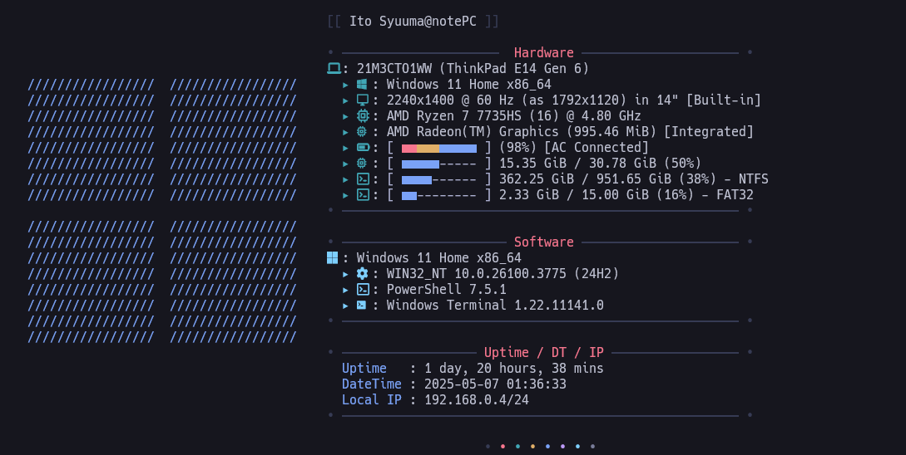
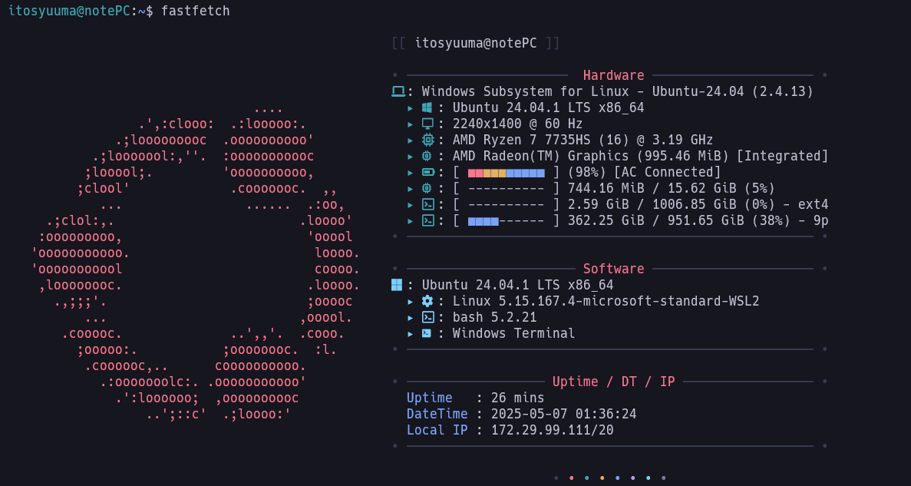

# fastfetch-theme

fastfetch の個人的なテーマ




## 使い方
### 1. fastfetch のインストール
詳しくは [fastfetch](https://github.com/fastfetch-cli/fastfetch)を参照。

### 2. fastfetch の設定ファイルを作成。
```bash
fastfetch --gen-config
```
`~/.config/fastfetch/config.jsonc` というファイルが作成される。

### 3. config.jsonc を上書き
3.このリポジトリの `config.jsonc`をコピー、 `~/.config/fastfetch/config.jsonc`に貼り付け。

